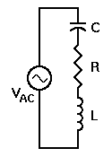

## Theory 

  

 

  We must take into account the different phase angles between voltage and current for each of the three components in the circuit. The vector diagram to the right illustrates this concept.

  Since this is a series circuit, the same current passes through all the components and therefore our reference is at a phase angle of 0°. This is shown in red in the diagram. The voltage across the resistor, <strong>VR</strong>, is in phase with the current and is shown in green. The blue vector shows <strong>VL</strong> at +90°, while the gold vector represents <strong>VC</strong>, at -90°. Since they oppose each other diametrically, the total reactive voltage is <strong>VL - VC</strong>. It is this difference vector that is combined with <strong>VR</strong> to find <strong>VT</strong> (shown in cyan in the diagram).

  We know that <strong>VT</strong> = 10 V RMS. Now we can see that <strong>VT</strong> is also the vector sum of (<strong>VL - VC</strong>) and <strong>VR</strong>. In addition, because of the presence of <strong>R</strong>, the phase angle between <strong>VT</strong> and <em>i</em> will be:

  <strong>θ = arctan((VL - VC) / VR)</strong>

θ can vary from -90° to +90°.

### The Mathematics:

  

 

 
<strong>Given:</strong>

<ul>
  <li>f = 10 Hz</li>
  <li>E = 100 V RMS</li>
  <li>L = 2 H</li>
  <li>C = 0.0003 F</li>
  <li>R = 10 &Omega;</li>
</ul>

<strong>Measured voltages:</strong>

<ul>
  <li>VL = 171.66 V</li>
  <li>VC = 72.6 V</li>
  <li>VR = 13.68 V</li>
</ul>

Voltage and current calculation for this circuit are based on Ohm's Law. Our basic expressions are:

$$I_L = \frac{V_L}{X_L} ; \quad I_C = \frac{V_C}{X_C} ; \quad I_R = \frac{V_R}{R} ; \quad I = \frac{V}{Z}$$

Since this is a series circuit, the value of "i" in each expression is the same. That is

$$i_L=i_C=i_R=i$$

  And we can use <em>i</em> as our reference value for our calculations. We will also need to know the value of 
  <strong>&omega;</strong> ( = 2&pi;f ) to determine <strong>XL</strong> and <strong>XC</strong>.

  For <strong>f = 10 Hz</strong>:

$$\omega = 2\pi f = 62.831853\,\mathrm{rad/s}$$

  Now we can complete our calculations, starting with <strong>XL</strong>, <strong>XC</strong>, and <strong>Z</strong>:

$$X_L = \omega L \approx 125.6637\mathrm{\Omega}$$
$$X_C = \frac{1}{\omega C} \approx 53.0618\mathrm{\Omega}$$
$$Z = \sqrt{(X_L - X_C)^2 + R^2} \approx 73.2874\mathrm{\Omega}$$
$$i = \frac{V}{Z} \approx 1.37\mathrm{A}$$
$$V_L = i \times X_L \approx 171.4\mathrm{V}$$
$$V_C = i \times X_C \approx 72.4\mathrm{V}$$
$$V_R = i \times R \approx 13.6\mathrm{V}$$
$$V = \sqrt{(V_L - V_C)^2 + V_R^2} \approx 99.9288\mathrm{V} \approx 100\mathrm{V}$$

Allowing for calculator round-off errors through all these calculations, the total voltage V is exactly 100 volts, which is what we initially specified. Therefore our calculations check out and our results are valid.

### Resonance and  Effect of R:

  At very low frequencies, capacitor <strong>C</strong> will be an open circuit, and virtually no current will flow through the circuit.
  At very high frequencies, inductor <strong>L</strong> will be an open circuit, and again no current will flow.
  However, at intermediate frequencies, both <em>XC</em> and <em>XL</em> will be moderate, and the difference between them will be small.
  At resonance, that difference will be zero, and only <strong>R</strong> will limit the current flow in the circuit.

  The graph to the right shows normalized values of current through a series RLC circuit at frequencies ranging from 0.01 times the resonant frequency, to 100 times that frequency.
  Beyond that range, as you can see from the graph, no significant current will flow at all.
  Within that range, current depends primarily on the value of <strong>R</strong>.

  <em>Note:</em> These values are used specifically to obtain a normalized graph.
  Once we have the graph, we can change the component values.
  Even though the resonant frequency and relative value of <strong>R</strong> changes, the shape of the curve will always be the same, as long as the ratio <strong>L/C</strong> remains constant.
  We'll see shortly what happens as that ratio changes.

  In a fully normalized circuit, <strong>R = 1 &Omega;</strong>. This will permit a current of 1 A to flow at resonance, as indicated by the green curve on the graph.
  Similarly, if we set <strong>R = 2 &Omega;</strong>, the current will be 0.5 A at resonance (shown in blue).

  The remaining curves show what happens if we reduce <strong>R</strong>:

<ul>
  <li>The yellow curve shows current when <strong>R = 0.5 &Omega;</strong></li>
  <li>The red curve is for <strong>R = 0.1 &Omega;</strong></li>
</ul>

  Note that for low values of <strong>R</strong>, the current at resonance peaks much higher but falls off very quickly as frequency changes.
  For higher values of <strong>R</strong>, the curve is much broader, and maximum current remains much lower.
  This is the standard trade-off between bandwidth and maximum current, and the value of <strong>R</strong> is critical for controlling this factor.

### Changing the Ratio of L/C:

  When we change the ratio of <strong>L/C</strong>, we change the reactance of both components at any given frequency without changing the resonant frequency.
  This is accomplished by making sure that the product of <strong>L</strong> and <strong>C</strong> remains constant even when we change their ratio.

  For example:
  <ul>
    <li>If <strong>L = 1 H</strong> and <strong>C = 1 F</strong>, then <strong>LC = 1</strong> and <strong>L/C = 1</strong>.</li>
    <li>If <strong>L = 2 H</strong> and <strong>C = 0.5 F</strong>, then <strong>LC = 1</strong>, but now <strong>L/C = 4</strong>.</li>
    <li>If <strong>L = 0.5 H</strong> and <strong>C = 2 F</strong>, then <strong>L/C = 0.25</strong>.</li>
  </ul>

  By changing <strong>L</strong> and <strong>C</strong> in this manner, we change the values of <em>XL</em> and <em>XC</em> at and near the resonant frequency without changing the resonant frequency itself.
  This controls the overall impedance of the circuit at frequencies near resonance and gives the resistor <strong>R</strong> either more or less control over current at those frequencies.

  The result is a change in the frequency range over which this circuit will conduct significant amounts of current.
  The following three graphs illustrate this effect:

  When we plot the curves this way, it becomes clear that as we increase the <strong>L/C</strong> ratio, we limit the circuit to passing current over an increasingly narrow band of frequencies.
  However, as we reduce the <strong>L/C</strong> ratio, we widen the frequency band over which this circuit will pass significant amounts of current.
  This becomes very important when we deal with certain types of filters, and especially with tuned circuits.

  This can be verified using the simulator by creating the above-mentioned series <strong>LCR</strong> circuit and by measuring the current and voltage across the inductor, capacitor, and resistor.
  The values should be consistent with the earlier findings.

### Applications:
 
1. LCR series circuit is also known as tuned or acceptor circuit.They have many applications particularly for oscillating circuits.
2. Series LCR circuit has applications in radio and communication engineering.
3. They can be used to select a certain narrow range of frequencies from the total spectrum of ambient radiowaves.For eg:AM/FM radio with analog tuners use a RLC circuit to tune a radio frequency.

